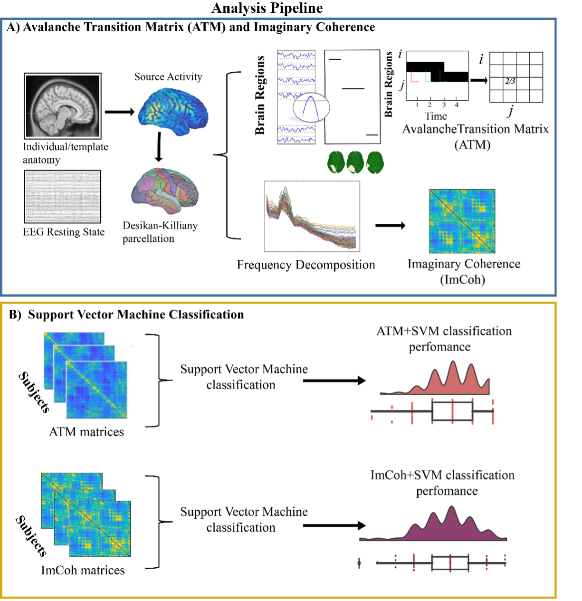
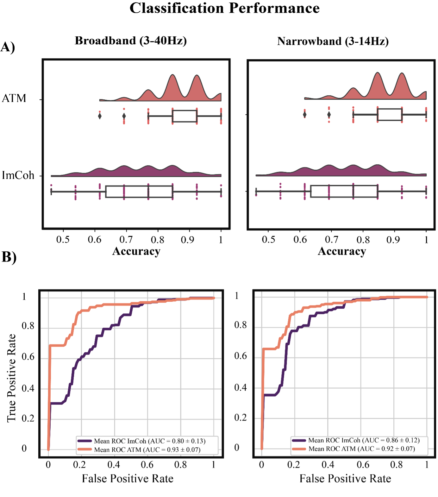

# Neuronal avalanches in temporal lobe epilepsy as a diagnostic tool: a noninvasive investigation of intrinsic resting state dynamics

---
This repository contains the code and supporting documents associated with the following manuscript:

Marie-Constance Corsi, Emahnuel Trois Lopez, Pierpaolo Sorrentino, Alberto Danieli, Simone Cuozzo, Paolo Bonanni, and Gian Marco Duma (2024). Neuronal avalanches in temporal lobe epilepsy as a diagnostic tool: a noninvasive investigation of intrinsic resting state dynamics. Scientific Reports. https://www.nature.com/articles/s41598-024-64870-3

 
---
## Authors:
* [Marie-Constance Corsi](https://marieconstance-corsi.netlify.app), Inria Paris, Paris Brain Institute, Sorbonne Université, France
* [Emahnuel Troisi Lopez](https://scholar.google.com/citations?user=1xfuS4oAAAAJ&hl=it), Institute of Applied Sciences and Intelligent Systems of National Research Council, Pozzuoli, Italy
* [Pierpaolo Sorrentino](https://scholar.google.nl/citations?user=T1k8qBsAAAAJ&hl=en), Institut de Neuroscience des Systèmes, Aix-Marseille University & University of Sassari, Department of Biomedical Sciences, Sassari, Italy
* Alberto Danieli, IRCCS E. Medea Scientific Institute, Epilepsy Unit, Treviso, Italy
* Simone Cuozzo, IRCCS E. Medea Scientific Institute, Epilepsy Unit, Treviso, Italy
* Paolo Bonanni, IRCCS E. Medea Scientific Institute, Epilepsy Unit, Treviso, Italy
* [Gian Marco Duma](https://scholar.google.ca/citations?user=EFlCo6EAAAAJ&hl=it), IRCCS E. Medea Scientific Institute, Epilepsy Unit, Treviso, Italy

---
## Abstract

*Background and Objectives:* The epilepsy diagnosis still represents a complex process, with misdiagnosis reaching 40%. Here, we aimed at building an automatable workflow, to help the clinicians in the diagnostic process, differentiating between controls and a population of patients with temporal lobe epilepsy (TLE). While primarily interested in correctly classifying the participants, we used data features providing hints on the underlying pathophysiological processes. Specifically, we hypothesized that neuronal avalanches (NA) may represent a feature that encapsulates the rich brain dynamics better than the classically used functional connectivity measures (Imaginary Coherence; ImCoh).

*Methods:* We recorded 10 minutes of resting state activity with high-density scalp electroencephalography (hdEEG; 128 channels). We analyzed large-scale activation bursts (NA) from source activation, to capture altered dynamics. Then, we used machine-learning algorithms to classify epilepsy patients vs. controls, and we described the goodness of the classification as well as the effect of the durations of the data segments on the performance.

*Results:* Using a support vector machine (SVM), we reached a classification accuracy of 0.86 ± 0.08 (SD) and an area under the curve (AUC) of 0.93 ± 0.07. The use of avalanches-derived features, generated a mean increase of 16% in the accuracy of diagnosis prediction, compared to ImCoh. Investigating the main features informing the model, we observed that the dynamics of the entorhinal cortex, superior and inferior temporal gyri, cingulate cortex and prefrontal dorsolateral cortex were informing the model with NA. Finally, we studied the time-dependent accuracy in the classification. While the classification performance grows with the duration of the data length, there are specific lengths, at 30s and 180s at which the classification performance becomes steady, with intermediate lengths showing greater variability. Classification accuracy reached a plateau at 5 minutes of recording.

*Discussion:* We showed that NA represents a better EEG feature for an automated epilepsy identification, being related with neuronal dynamics of pathology-relevant brain areas. Furthermore, the presence of specific durations and the performance plateau might be interpreted as the manifestation of the specific intrinsic neuronal timescales altered in epilepsy. The study represents a potentially automatable and noninvasive workflow aiding the clinicians in the diagnosis.

## Code
This repository contains the code used to run the analysis performed and to plot the figures.
Analysis was performed with the following Matlab version: 9.10.0.1649659 (R2021a) Update 1.
For a complete list of the Matlab packages used for the analysis, please refer to the 'Start_SessionMatlab.m' file.
In 'requirements.txt' a list of all the Python dependencies is proposed to plot the connectomes.

---
## Figures

### Figure 1 - Analysis pipeline 

### Figure 2 - Accuracy and receiver operating characteristic curves

*A. Full distribution of the classification accuracy of the support vector machine (SVM) model across the cross-validation splits when trained with avalanche transition matrix (ATM) and imaginary coherence (ImCoh). On the left the accuracy classification using narrow-band filtered signal (3-14 Hz) and on right broadband signal (3-40 Hz). B. Mean receiver operating characteristic (ROC) curves across cross-validation splits and the corresponding area under the curve (AUC), both for ATM (salmon line) and ImCoh (purple line).*

### Figure 3 - Feature importance for model interpretability

*A. histogram of the probability of the feature importance value in ATM and ImCoh. The histogram shows a narrow distribution for ImCoh and broader distribution for ATM, suggesting that in ATM that certain edges drive the majority of information necessary for differentiation of the two groups. B. Edge representation in a chord plot, showing the importance of each edge in the classification. C. Mean importance value of each edge of a specific brain region. This representation highlights which regions mainly impact in the classification.*

### Figure 4 - Time dependence of classification accuracy

